# Attestor Internal Machine Map

Status: raw internal structure map for the current repository shape.

This document shows how Attestor is built inside: the major parts, the decision axes, the fan-out/fan-in points, and the outputs that become a downstream consequence decision.

## Core Shape

Attestor is a consequence control system with three main decision blocks and several side loops:

```text
AI / caller proposes a consequence
  -> ingress and tenant context
  -> release / policy decision block
  -> consequence admission block
  -> enforcement / customer gate block
  -> downstream consequence or hold
```

The most compact internal model is:

```text
release PDP -> admission PDP -> enforcement PEP
```

The release PDP decides whether a proposed output can become a release. The admission PDP turns a domain-specific result into the shared `admit`, `narrow`, `review`, `block` vocabulary. The enforcement PEP checks the final presentation at the downstream boundary before anything real happens.

## One-Picture Internal Map

This is the visual index for the repository. It is one picture: every major architectural element group and every main runtime route represented by this map should be readable from left to right. The tables and path sections below unpack the same picture.

```mermaid
flowchart LR
  subgraph CALLERS["Callers and proposed consequences"]
    AI["AI agent / app / operator"]
    LLM["Model/provider edge<br/>src/api/openai.ts<br/>src/api/llm-provider-registry.ts"]
    GEN["Generic action<br/>POST /api/v1/admissions"]
    FIN["Finance run<br/>POST /api/v1/pipeline/run"]
    CRY["Crypto execution plan<br/>wallet / account / contract / payment"]
    RLC["Release-layer caller<br/>release evaluation request"]
  end

  subgraph SERVICE["Service ingress and tenant runtime"]
    ROUTES["Hono routes and runtime wiring<br/>src/service/*"]
    CORE_ROUTES["Core route group<br/>startup / health / ready / domains / connectors / metrics"]
    PUBLIC_ROUTES["Public site and proof route group<br/>/ / proof pages / billing return pages"]
    AUTH_ROUTES["Auth and account route group<br/>auth / account / OIDC / SAML / passkeys / MFA / API keys / billing self-service"]
    ADMIN_ROUTES["Admin and operator route group<br/>accounts / plans / tenant keys / queue / release reviews / policy control / degraded-mode"]
    PIPELINE_ROUTES["Pipeline route group<br/>run / run-async / status / verify / filing export"]
    ADMISSION_ROUTES["Admission and shadow route group<br/>admissions / shadow / action-surface / hosted onboarding"]
    WEBHOOK_ROUTES["Webhook route group<br/>Stripe billing / SendGrid / Mailgun"]
    TENANT["Tenant isolation / account / auth / plan context"]
    GUARD["Production request guard / trusted proxy / usage meter"]
    BOOT["Bootstrap runtime<br/>release runtime / route builders / registries"]
  end

  subgraph AXES["Ten decision axes applied to the same candidate"]
    TIME["Time<br/>TTL / expiry / freshness / replay window"]
    ID["Identity<br/>tenant / actor / audience / sender binding"]
    CONTENT["Content<br/>output contract / redaction / forbidden raw classes"]
    EVID["Evidence<br/>proof refs / provenance / evidence pack"]
    RISK["Risk<br/>R0-R4 / control matrix / failure modes"]
    SCOPE["Scope and intent<br/>capability boundary / target / data domain"]
    ROLLOUT["Rollout<br/>dry-run / canary / enforce / rolled-back"]
    CONSEQ["Consequence<br/>domain / boundary / reversibility / receipt"]
    HUMAN["Human authority<br/>reviewer / dual approval / override / break-glass"]
    CRYPTOAX["Cryptography<br/>digest / EdDSA JWT / DPoP / mTLS / SPIFFE / signatures"]
  end

  subgraph POLICY["Policy control plane and authority material"]
    PBUNDLE["Policy bundles<br/>format / signing / cache"]
    PSCOPE["Scoping / discovery / activation / approvals"]
    PSIM["Simulation / impact summary / test pack"]
    PRUNTIME["Runtime bridge / resolver / control-plane store"]
    SIGNER["Tenant signer boundary<br/>local signer / external KMS profile"]
  end

  subgraph RELEASE["Release PDP<br/>src/release-kernel + src/release-layer"]
    RMAT["Release material<br/>target / output contract / hashes / capability boundary"]
    RPOL["Policy resolution"]
    RROLL["Rollout resolution"]
    RCHK["Deterministic release checks<br/>contract / target / capability / hash / policy / evidence / trace / provenance / receipt"]
    RDEC{"ReleaseDecision<br/>accepted / denied / hold / review-required / expired / revoked / overridden"}
    RTOK["Release token / evidence pack / introspection record"]
    RQ["Reviewer queue"]
    RSTOP["Stop before release"]
    RSHADOW["Shadow release evaluator"]
  end

  subgraph PACKS["Domain packs projected into the shared machine"]
    FPW["Financial proof wedge<br/>src/financial/*<br/>src/proof-surface/*"]
    FREL["Finance record / communication / action release material"]
    FADM["Finance admission projection<br/>six canonical checks"]
    FILING["Filing adapters<br/>src/filing/*<br/>XBRL / QRDA / Cypress / CMS / report package"]
    CAUTH["Crypto authorization core<br/>programmable-money objects / replay / simulation / account abstraction"]
    CEXEC["Crypto execution-admission package<br/>Safe / ERC-4337 / modular account / delegated EOA / x402 / custody / solver"]
    CINT["Crypto intelligence<br/>risk / privacy / adapter readiness / package surface"]
    CADM["Crypto admission projection<br/>six canonical checks"]
    DOM["Other domain packs<br/>src/domains/*<br/>healthcare / custom domains / connector-backed domains"]
  end

  subgraph ADMISSION["Admission PDP<br/>src/consequence-admission/*"]
    GENV["Generic admission envelope"]
    MODE["Mode ladder<br/>observe / warn / review / enforce"]
    AREQ["ConsequenceAdmissionRequest"]
    ACHK["Admission checks<br/>policy / authority / evidence / freshness / enforcement / adapter-readiness"]
    ADEC{"Canonical decision<br/>admit / narrow / review / block"}
    AOUT["ConsequenceAdmissionResponse<br/>allowed / failClosed / constraints / proof / feedback / retry"]
    PTOK["Optional protected release token<br/>for high-risk allowed generic admission"]
    FAC["Facade<br/>finance and crypto native decision mapping"]
  end

  subgraph ENFORCE["Enforcement PEP and customer gate"]
    EPSEL{"Enforcement path"}
    DCON["Downstream enforcement contract"]
    EPROF["Verification profile<br/>consequence type + risk class + boundary"]
    PMODE["Presentation mode<br/>bearer / DPoP / mTLS / SPIFFE / HTTP signature / signed envelope"]
    OFF["Offline verification<br/>signature / digest / binding"]
    ON["Online verification<br/>introspection / freshness / replay / usage"]
    ERES{"Enforcement result<br/>allow / deny / shadow-allow / needs-introspection / break-glass-allow"}
    CGATE{"Customer gate<br/>proceed / hold"}
  end

  subgraph STORE["Shared storage, audit, and redaction surfaces"]
    ATOMIC["Shared atomic stores<br/>retry / replay / idempotency"]
    HISTORY["Shared history + outbox<br/>source history / worker claim / advisory lock contract"]
    SHSTORE["Shadow persistence stores<br/>events / simulations / candidates / activation receipts"]
    AUDIT["Audit and review surfaces<br/>audit export / tamper-evident history / dashboard / external review packet"]
    REDACT["Data minimization surfaces<br/>34 surfaces / 15 forbidden raw classes"]
    CONN["Downstream connector boundary<br/>src/connectors/*<br/>Postgres / Snowflake / schema attestation"]
  end

  subgraph FOUNDATION["Shared support and non-decision surfaces"]
    IDENTITY["Identity clients<br/>src/identity/*<br/>OIDC / device flow / token cache / secure token store"]
    SIGNING["Signing and verification helpers<br/>src/signing/*<br/>keys / PKI / certificate / keyless signer / verify CLI"]
    PLATFORM["Platform primitives<br/>src/platform/*<br/>file store / string normalization"]
    UTILS["Utilities<br/>src/utils/*<br/>logger / errors"]
    SHOWCASE["Showcase surface<br/>src/showcase/*<br/>committed public proof/demo material"]
  end

  subgraph SHADOW["Shadow-to-policy side loop"]
    SEVENT["Shadow admission/release event"]
    ASURF["Action surface profiler / manifest intake / integration artifacts"]
    RINV["Action risk inventory / failure-mode map"]
    CAND["Policy discovery candidate / candidate registry"]
    QUESTIONS["Active questions / authority relationship context"]
    TWIN["Policy twin / replay / counterexamples / adversarial replay"]
    PACKET["Review packet / review-only patch pack / promotion packet"]
    HANDOFF["Activation handoff / publication / customer activation receipt"]
  end

  subgraph OUTPUTS["Terminal outcomes"]
    RUN["Run downstream consequence"]
    HOLD["Hold / do not run downstream consequence"]
    REVIEW["Human review queue"]
    OBSERVE["Observed only / shadow learning"]
  end

  AI --> LLM
  LLM --> ROUTES
  AI --> ROUTES
  ROUTES --> TENANT
  TENANT --> GUARD
  GUARD --> BOOT
  BOOT --> CORE_ROUTES
  BOOT --> PUBLIC_ROUTES
  BOOT --> AUTH_ROUTES
  BOOT --> ADMIN_ROUTES
  BOOT --> PIPELINE_ROUTES
  BOOT --> ADMISSION_ROUTES
  BOOT --> WEBHOOK_ROUTES
  BOOT --> RLC

  ADMISSION_ROUTES --> GEN
  PIPELINE_ROUTES --> FIN
  PIPELINE_ROUTES --> FILING
  PIPELINE_ROUTES --> SIGNING
  AUTH_ROUTES --> TENANT
  ADMIN_ROUTES --> PBUNDLE
  ADMIN_ROUTES --> RQ
  ADMIN_ROUTES --> AUDIT
  ADMIN_ROUTES --> SIGNER
  WEBHOOK_ROUTES --> HISTORY
  PUBLIC_ROUTES --> SHOWCASE
  CORE_ROUTES --> TENANT
  CORE_ROUTES --> CONN
  CORE_ROUTES --> AUDIT
  BOOT --> CRY

  GEN --> GENV
  FIN --> FPW
  FIN --> FREL
  CRY --> CAUTH
  CRY --> CEXEC
  RLC --> RMAT

  FPW --> FREL
  FILING --> FREL
  FILING --> DOM
  FREL --> RMAT
  FREL --> FADM
  CAUTH --> CEXEC
  CEXEC --> CINT
  CINT --> CADM
  DOM --> GENV
  DOM --> AREQ

  PBUNDLE --> RPOL
  PSCOPE --> RPOL
  PRUNTIME --> RPOL
  PSIM --> RSHADOW
  SIGNER --> RTOK
  SIGNER --> PTOK

  RMAT --> TIME
  RMAT --> ID
  RMAT --> CONTENT
  RMAT --> EVID
  RMAT --> RISK
  RMAT --> SCOPE
  RMAT --> ROLLOUT
  RMAT --> CONSEQ
  RMAT --> HUMAN
  RMAT --> CRYPTOAX

  GENV --> TIME
  GENV --> ID
  GENV --> CONTENT
  GENV --> EVID
  GENV --> RISK
  GENV --> SCOPE
  GENV --> ROLLOUT
  GENV --> CONSEQ
  GENV --> HUMAN
  GENV --> CRYPTOAX

  TIME --> RPOL
  ID --> RPOL
  CONTENT --> RCHK
  EVID --> RCHK
  RISK --> RCHK
  SCOPE --> RPOL
  ROLLOUT --> RROLL
  CONSEQ --> EPROF
  HUMAN --> RQ
  CRYPTOAX --> OFF

  RPOL --> RROLL
  RROLL --> RCHK
  RCHK --> RDEC
  RROLL --> RSHADOW
  RSHADOW --> SEVENT
  RDEC -->|"accepted / overridden"| RTOK
  RDEC -->|"hold / review-required"| RQ
  RDEC -->|"denied / expired / revoked"| RSTOP
  RQ --> REVIEW
  RSTOP --> HOLD

  GENV --> MODE
  MODE --> AREQ
  FADM --> FAC
  CADM --> FAC
  FAC --> AREQ
  AREQ --> ACHK
  ACHK --> ADEC
  ADEC --> AOUT
  AOUT -->|"high-risk allowed generic path"| PTOK
  RTOK --> AOUT
  PTOK --> AOUT

  AOUT --> EPSEL
  EPSEL --> DCON
  EPSEL --> EPROF
  EPSEL --> CGATE
  EPROF --> PMODE
  PMODE --> OFF
  OFF --> ON
  ON --> ERES
  DCON --> CGATE
  ERES --> CGATE

  CGATE -->|"proceed"| RUN
  CGATE -->|"hold"| HOLD
  RUN --> CONN
  CONN --> HISTORY

  IDENTITY --> TENANT
  SIGNING --> SIGNER
  SIGNING --> CRYPTOAX
  SIGNING --> OFF
  PLATFORM --> ROUTES
  PLATFORM --> ATOMIC
  UTILS --> ROUTES
  UTILS --> AOUT
  SHOWCASE --> AUDIT

  AREQ --> ATOMIC
  AOUT --> HISTORY
  RTOK --> HISTORY
  PTOK --> HISTORY
  ERES --> HISTORY
  HISTORY --> AUDIT
  ATOMIC --> ON
  SHSTORE --> AUDIT
  REDACT --> AUDIT
  REDACT --> AOUT
  REDACT --> SEVENT
  REDACT --> PACKET

  MODE -->|"observe / warn shadow signal"| SEVENT
  AOUT --> SEVENT
  SEVENT --> SHSTORE
  SEVENT --> ASURF
  ASURF --> RINV
  RINV --> CAND
  CAND --> QUESTIONS
  CAND --> TWIN
  QUESTIONS --> PACKET
  TWIN --> PACKET
  PACKET --> HANDOFF
  HANDOFF --> PBUNDLE
  HANDOFF --> PSCOPE
  SEVENT --> OBSERVE
```



## Main Parts

| Part | Main code | What it does inside the machine |
|---|---|---|
| Upstream model/provider edge | `src/api/openai.ts`, `src/api/llm-provider-registry.ts`, `src/api/llm-provider-models.ts` | Normalizes the model/provider side before consequences are proposed or evaluated. |
| Release kernel | `src/release-kernel/*` | Defines consequence types, risk classes, release decisions, release policies, rollout, deterministic checks, shadow evaluation, tokens, evidence packs, reviewer queue, introspection, verification, and finance release wedges. |
| Release layer public surface | `src/release-layer/index.ts`, `src/release-layer/finance.ts` | Curated package boundary over the release kernel and finance release wedges. |
| Policy control plane | `src/release-policy-control-plane/*` | Handles policy bundles, signing, scoping, discovery, activation, resolution, simulation, runtime bridge, audit, and control-plane storage. |
| Consequence admission core | `src/consequence-admission/index.ts` | Defines the shared admission request/response contract, decisions, checks, proof refs, generic mode ladder, retry guidance, feedback, canonical digest, and descriptor. |
| Domain admission projections | `src/consequence-admission/finance.ts`, `src/consequence-admission/crypto.ts`, `src/consequence-admission/facade.ts` | Converts finance and crypto native results into the shared admission vocabulary. |
| Enforcement plane | `src/release-enforcement-plane/*` | Verifies release authorization at downstream boundaries through offline verification, online introspection, replay, sender-bound presentation, middleware, webhooks, Envoy/Istio, record-write, communication-send, and action-dispatch gateways. |
| Customer gate | `src/consequence-admission/customer-gate.ts` | Last local allow/hold decision before customer-side execution. It can evaluate plain admission, signed bearer token, or release-enforcement verification. |
| Crypto execution admission | `src/crypto-execution-admission/*` | Packages wallet/RPC/Safe/ERC-4337/modular-account/delegated-EOA/x402/custody/intent-solver execution plans into admission-ready evidence and handoff objects. |
| Crypto authorization core | `src/crypto-authorization-core/*` | Models programmable-money authorization objects, risk mappings, simulations, replay/freshness, and signing/account abstraction surfaces. |
| Crypto intelligence | `src/crypto-intelligence/*` | Adds crypto risk, adapter-readiness, privacy, performance, and package-surface summaries. |
| Financial proof wedge | `src/financial/*`, `src/proof-surface/*`, `src/release-kernel/finance-*.ts` | Runs and binds the finance proof path, then projects record, communication, and action release material. |
| Filing adapters | `src/filing/*` | Handles filing/export adapter material such as XBRL, QRDA, Cypress/CMS validation helpers, and report packages before those paths enter pipeline or domain-pack handling. |
| Service composition root | `src/service/*` | Hono routes, hosted runtime wiring, tenant isolation, shared stores, route runtime, admin routes, pipeline routes, shadow routes, generic admission routes, and production/rehearsal primitives. |
| Hosted identity support | `src/identity/*`, `src/service/account-*.ts`, `src/service/request-context.ts` | Supplies OIDC/device-flow/token-cache/keychain and hosted account/session/auth context that feeds tenant, actor, and audience binding. |
| Shared storage primitives | `src/service/consequence-shared-atomic-stores.ts`, `src/service/consequence-shared-history-outbox-store.ts` | Shared retry/replay, source-history, and outbox store primitives used by consequence-side runtime paths. |
| Signing and verification support | `src/signing/*` | Supplies key, PKI, certificate, keyless-signer, bundle, and verification helpers used by release, evidence, and presentation verification paths. |
| Platform and utility primitives | `src/platform/*`, `src/utils/*` | Small shared primitives such as file-store/string normalization, logger, and error helpers used by runtime and domain code. |
| Showcase surface | `src/showcase/*`, `src/service/site.ts`, `src/service/site-support.ts` | Committed proof/demo surface and public site support. It is not a separate decision engine. |
| Shadow-to-policy side loop | `src/consequence-admission/shadow-*.ts`, `src/consequence-admission/policy-foundry-*.ts`, `src/consequence-admission/action-surface-*.ts` | Turns observed shadow/admission events into action surfaces, risk inventories, candidates, active questions, replay reports, review packets, and onboarding artifacts. |
| Data minimization and audit surfaces | `src/consequence-admission/data-minimization-redaction-policy.ts`, `src/consequence-admission/audit-evidence-export.ts`, `src/consequence-admission/tamper-evident-history.ts`, `src/consequence-admission/business-risk-dashboard.ts`, `src/consequence-admission/dashboard-api-summary.ts`, `src/consequence-admission/external-review-packet.ts` | Shapes what internal and reviewer-facing outputs can expose. |

## The Ten Decision Axes

The same proposed consequence is viewed across ten axes before a final run/hold result appears.

| Axis | Question answered | Main structures | What it contributes |
|---|---|---|---|
| Time | Is this decision still fresh? | token TTL, expiry, `notBefore`, freshness rules, replay windows, context age, stale authority checks | freshness outcome, expiry outcome, stale/valid state |
| Identity | Who is asking, for whom, and to which boundary? | tenant context, actor, reviewer, signer, audience, DPoP, mTLS, SPIFFE, workload binding | tenant/audience/sender binding, actor chain, reviewer/signer authority |
| Content | What is inside the proposed consequence and exposed outputs? | output contract, artifact type, expected shape, data minimization surface, forbidden raw classes, safety scanner | safe/redacted output shape, raw-data rejection, artifact compatibility |
| Evidence | What proves the action is grounded? | proof refs, required evidence kinds, provenance binding, evidence pack, audit chain, downstream receipt | evidence completeness, proof material, provenance status |
| Risk | How much control is required? | R0-R4, deterministic control matrix, failure-mode registry, domain risk profile | required check set, review mode, token enforcement, default failure disposition |
| Scope / intent | What is the action allowed to touch? | policy scope, capability boundary, allowed tools, allowed targets, allowed data domains, policy entry match | policy match, capability-boundary pass/fail, target/data-domain binding |
| Rollout | Is the policy observed or enforced now? | dry-run, canary, enforce, rolled-back, SHA-256 bucket, shadow evaluator | shadow/enforce evaluation mode, rollout reason, canary bucket |
| Consequence | What happens if this crosses the boundary? | consequence type, admission domain, downstream system, boundary kind, idempotency/replay, downstream receipt | enforcement path, receipt expectation, replay/idempotency requirement |
| Human | Is human authority required? | review authority mode, reviewer queue, named reviewer, dual approval, override, break-glass | review-required/accepted/overridden state, reviewer evidence |
| Cryptography | Can the decision be verified mechanically? | SHA-256 digests, EdDSA JWT, PKI material, DPoP, mTLS, SPIFFE, HTTP message signatures, signed envelopes, tamper-evident history | token validity, sender constraint, digest binding, tamper evidence |

## Axis Fan-Out / Fan-In

The ten-axis fan-out and the fan-in points are shown inside the single picture above. In that picture, a candidate passes through `Time`, `Identity`, `Content`, `Evidence`, `Risk`, `Scope and intent`, `Rollout`, `Consequence`, `Human authority`, and `Cryptography`; those facts then feed the release, admission, enforcement, and customer-gate aggregators.

## Aggregators

| Aggregator | Input shape | Output shape |
|---|---|---|
| Release policy resolver | target, output contract, capability boundary, target kind, rollout context | active policy resolution: resolved or fail-state |
| Release rollout resolver | policy rollout definition and request-bound cohort material | shadow/enforce evaluation mode, reason, canary bucket |
| Deterministic release checks | policy, release decision skeleton, observation | pass/fail outcomes, findings, next phase |
| Release decision engine | policy resolution plus deterministic check report | `ReleaseDecision` with release status and plan |
| Shadow release evaluator | release request plus observation | pass-through shadow result with would-status and signals |
| Consequence admission response builder | request, decision, checks, proof, constraints, native decision | canonical admission object with digest, allowed, failClosed |
| Generic admission mode ladder | explicit mode plus observed fields | shadow decision, effective decision, downstream posture |
| Finance admission projection | finance run/release summary | six canonical checks and finance-mapped admission |
| Crypto admission projection | crypto execution plan | six canonical checks and crypto-mapped admission |
| Protected release-token issuer | high-risk allowed generic admission plus sender confirmation | sender-constrained release token proof ref and authorization |
| Offline enforcement verifier | enforcement request, presentation, verification key | valid / invalid / indeterminate local verification |
| Online enforcement verifier | offline verification plus introspection and usage store | valid / invalid live verification with replay consumption |
| Customer gate | admission plus optional bearer or release-enforcement result | `proceed` or `hold` |

## Current Structural Counts

| Area | Count | Values / source |
|---|---:|---|
| Release consequence types | 4 | `communication`, `record`, `action`, `decision-support` |
| Risk classes | 5 | `R0`, `R1`, `R2`, `R3`, `R4` |
| Release decision statuses | 7 | `accepted`, `denied`, `hold`, `review-required`, `expired`, `revoked`, `overridden` |
| Terminal release statuses | 5 | `accepted`, `denied`, `expired`, `revoked`, `overridden` |
| Deterministic control categories | 9 | release contract, target, capability, hash, policy, evidence, trace, provenance, downstream receipt |
| Release rollout modes | 4 | `dry-run`, `canary`, `enforce`, `rolled-back` |
| Release rollout reasons | 6 | `dry-run`, `canary-enforce`, `canary-shadow`, `canary-missing-context`, `enforce`, `rolled-back` |
| Admission decisions | 4 | `admit`, `narrow`, `review`, `block` |
| Generic admission modes | 4 | `observe`, `warn`, `review`, `enforce` |
| Generic shadow decisions | 4 | `would_admit`, `would_narrow`, `would_review`, `would_block` |
| Consequence admission checks | 6 | `policy`, `authority`, `evidence`, `freshness`, `enforcement`, `adapter-readiness` |
| Consequence admission domains | 10 | financial, money, programmable-money, data, authority, communication, filing, operation, decision-support, custom |
| Data minimization surfaces | 34 | model feedback, shadow, policy foundry, audit, dashboard, presentation, replay, execution receipt surfaces |
| Forbidden raw data classes | 15 | raw prompts, outputs, tool payloads, customer identifiers, personal/payment/wallet/evidence/database/downstream/secret/replay material |
| Failure modes | 20 | prompt injection, tool misuse, data leakage, tenant leakage, stale authority, replay, review bypass, supply-chain compromise, and related modes |
| Enforcement point kinds | 8 | middleware, webhook, async, record, communication, action, proxy, artifact verifier |
| Enforcement boundary kinds | 8 | HTTP, webhook, async, record-write, communication-send, action-dispatch, proxy-admission, artifact-export |
| Enforcement verification modes | 4 | offline signature, online introspection, hybrid required, shadow observe |
| Release presentation modes | 6 | bearer, DPoP, mTLS, SPIFFE, HTTP message signature, signed JSON envelope |
| Enforcement outcomes | 5 | allow, deny, shadow-allow, needs-introspection, break-glass-allow |
| Enforcement failure reasons | 23 | missing/invalid/expired/revoked/replayed/stale/wrong-binding/introspection/policy/break-glass classes |
| Public package entrypoints | 9 | root plus release, policy, enforcement, crypto, admission, and finance subpaths |

## Route Groups Covered By The Picture

The one-picture map includes route groups rather than every individual endpoint label. The current service surface groups into these lanes:

| Route group in picture | Representative routes | Main target inside the machine |
|---|---|---|
| Core route group | `/api/v1/startup`, `/api/v1/health`, `/api/v1/ready`, `/api/v1/domains`, `/api/v1/connectors`, `/api/v1/metrics` | runtime liveness/readiness, registries, connector/domain visibility |
| Generic admission route group | `POST /api/v1/admissions` | generic admission envelope, mode ladder, protected release token path |
| Pipeline route group | `POST /api/v1/pipeline/run`, `POST /api/v1/pipeline/run-async`, `GET /api/v1/pipeline/status/:jobId` | finance pipeline, async execution, release material, admission projection |
| Verification and filing route group | `POST /api/v1/verify`, `POST /api/v1/filing/export` | signing/PKI verification and filing adapter export path |
| Shadow and onboarding route group | `/api/v1/shadow/*`, `/api/v1/shadow/policy-foundry/*`, action-surface onboarding routes | shadow event stores, policy foundry, action surface, promotion/handoff material |
| Admin and operator route group | `/api/v1/admin/accounts*`, `/api/v1/admin/release-reviews*`, `/api/v1/admin/release-policy*`, `/api/v1/admin/tenant-keys*`, `/api/v1/admin/queue*`, `/api/v1/admin/release-enforcement/degraded-mode/*` | account operations, policy control plane, reviewer queue, signer/tenant-key, queue and degraded-mode controls |
| Auth and account route group | `/api/v1/auth/*`, `/api/v1/account*`, `/api/v1/account/billing/*`, OIDC/SAML/passkey/MFA routes | tenant/account/session identity context and customer billing/account surfaces |
| Webhook route group | `POST /api/v1/billing/stripe/webhook`, `POST /api/v1/email/sendgrid/webhook`, `POST /api/v1/email/mailgun/webhook` | external event ingestion into billing/email stores and shared history surfaces |
| Public site/proof route group | `/`, `/financial-reporting-acceptance`, `/proof/financial-reporting-acceptance*`, billing return pages | committed proof/demo and public presentation surface |

## Path 1: Generic Admission

```text
POST /api/v1/admissions
  -> tenant context is injected
  -> generic admission envelope is built
  -> mode ladder evaluates observe / warn / review / enforce
  -> six admission checks are produced from the domain profile
  -> high-risk enforce admissions may require protected release-token issuance
  -> shadow admission event can be recorded
  -> caller receives canonical admission envelope
```

Shape:

```text
generic request
  -> GenericAdmissionEnvelope
  -> ConsequenceAdmissionResponse
  -> optional protected release token
  -> downstream customer PEP
```

## Path 2: Finance Pipeline

```text
POST /api/v1/pipeline/run
  -> finance pipeline report
  -> record release candidate if filing material exists
  -> release material with output hash and consequence hash
  -> release decision engine
  -> finance-domain finalization
  -> token / evidence pack / reviewer queue when applicable
  -> finance admission projection
  -> customer gate or enforcement plane before downstream write/export
```

Finance also emits two shadow-first release flows:

```text
finance report -> communication release material -> shadow release summary
finance report -> action release material -> shadow release summary
```

So finance is not one line. It is one hard record wedge plus communication/action shadow branches.

## Path 3: Crypto Execution Admission

```text
crypto execution plan
  -> package-boundary admission request
  -> plan outcome maps to admit / review / block
  -> six canonical admission checks
  -> proof refs from plan digest, simulation digest, source package
  -> customer adapter / enforcement plane before wallet or execution boundary
```

Crypto stays a pack projection into the same admission machine:

```text
wallet / account / contract / payment plan
  -> crypto execution-admission package
  -> shared consequence admission
  -> customer-side protected execution
```

## Path 4: Release Enforcement

```text
release token or signed presentation
  -> enforcement request
  -> verification profile from consequence type + risk class + boundary kind
  -> presentation mode check
  -> offline signature and binding verification
  -> online introspection when required
  -> replay / usage consumption when required
  -> enforcement result
  -> customer gate
```

Presentation modes are the transport shapes that carry release authorization:

```text
bearer-release-token
dpop-bound-token
mtls-bound-token
spiffe-bound-token
http-message-signature
signed-json-envelope
```

## Path 5: Shadow-To-Policy Side Loop

Shadow is not the main allow/hold edge. It is the learning and onboarding side loop.

```text
shadow event
  -> action surface summary
  -> action risk inventory
  -> policy discovery candidate
  -> policy foundry candidate registry
  -> active questions
  -> replay / counterexample reports
  -> review packet
  -> activation handoff / receipt
```

This loop explains why the repo has many `shadow-*`, `policy-foundry-*`, and `action-surface-*` modules. They are not separate products. They are the side loop that turns observed traffic into structured onboarding material.

## Result Emergence

The final result does not come from one boolean.

It emerges like this:

```text
1. Normalize the proposed consequence.
2. Bind it to tenant, actor, target, output contract, and consequence hash.
3. Resolve policy and rollout.
4. Run release checks where the path uses the release layer.
5. Project the domain-native result into the shared admission vocabulary.
6. Run admission checks across policy, authority, evidence, freshness, enforcement, and adapter-readiness.
7. Select the minimum enforcement path from risk, domain, and boundary.
8. Verify token/presentation/proof/replay at the customer or enforcement edge.
9. Customer gate returns proceed or hold.
```

The internal shape is therefore:

```text
many axes
  -> structured facts
  -> check fan-out
  -> aggregation
  -> proof/token/review side outputs
  -> downstream gate
  -> proceed or hold
```

## Folder View

```text
src/
  api/                         model/provider edge
  release-kernel/              release vocabulary, policy, checks, token, evidence, review
  release-layer/               curated release package surface
  release-policy-control-plane/ policy bundles, activation, resolver, runtime bridge
  release-enforcement-plane/   downstream verifier and PEP surfaces
  consequence-admission/       shared admission core, packs, gates, shadow, policy foundry
  crypto-authorization-core/   programmable-money authorization core
  crypto-execution-admission/  crypto execution plan admission package
  crypto-intelligence/         crypto risk/readiness intelligence package
  filing/                      filing/export adapters and validation helpers
  financial/                   finance proof and pipeline domain
  identity/                    OIDC, device flow, token cache, secure token store
  platform/                    local platform primitives
  proof-surface/               local proof scenarios and exports
  service/                     Hono service, routes, stores, runtime wiring
  showcase/                    committed proof/demo surface
  domains/                     domain pack registry and pack descriptors
  signing/                     key, PKI, certificate, verification helpers
  connectors/                  downstream data connector boundary
  utils/                       shared logger/error helpers

docs/
  01-overview/                 product and customer-facing operating docs
  02-architecture/             internal architecture, buildout trackers, platform maps
  03-governance/               cryptography, retention, shared responsibility
  08-deployment/               deployment and enforcement-plane operational docs
  audit/                       audit validation notes
  research/                    research provenance ledger

tests/
  release-kernel-*             release decision and token tests
  release-policy-control-*     policy plane tests
  release-enforcement-plane-*  enforcement verifier and gateway tests
  consequence-admission-*      admission contract, packs, gates, readiness tests
  crypto-*                     crypto authorization, execution admission, intelligence tests
  production-*                 production/rehearsal/shared-store probes and contracts
```
